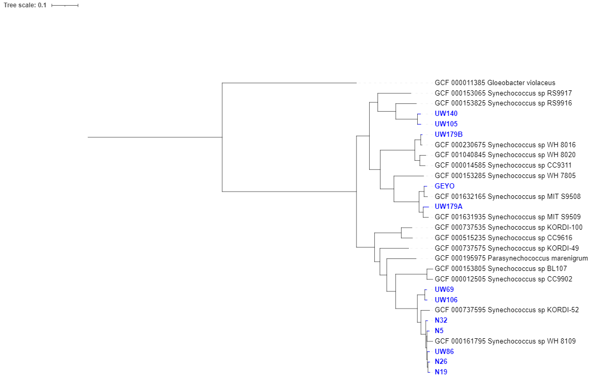

# GToTree_workflow
This is a workflow pipeline for analyzing _Synechococcus_ genomes and creating a Phylogenetic Tree using the guide given by astrobiomike

## How To Create Environment
#### Needed Dependencies 
- GToTree

If you would like to use the envionment used to run this analysis I have already supplied it on the .yml file. All you have to do is to run the code below within this repository:
```
conda env create -f gtotree_env.yml
```
#### Needed Data to Run GToTree
- Genomes to be worked on
- Target genes to be used for the pylogenetic tree (Reference)

## Obtaining Genomes
For this example we used _Synechococcus_ that was already given by the site. 
```
curl -L -o syn-gtotree-example.tar.gz https://ndownloader.figshare.com/files/23629763
```

Were the commands did the following actions:
- curl ; Transfer data from a server
- L ; Define the site from were we'll obtain the data
- o ; Define where we want to store the file or to name is at we require

So based on the command we are downloading the dataset and renaming it syn-gtotree-example.tar.gz to be a compressed archive

To extract the files from the compressed archive we'll use the tar command 
```
tar -xvzf syn-gototree-example.tar.gz
```

Were the commands did the following actions:
- x ; extract the files from the archive
- v ; show the progress of the extraction
- z ; filter the files through gzip
- f ; create files with given filenames

This will create a folder with the following files
- Sequence Genomes Files (fasta files)
- NCBI Assembly accessions (ref-syn-accs.txt)

To input the data we need to list them in a txt file
```
ls *.fa > our-genome-fasta-files.txt
```

Were the commands did the following actions:
- ls ; create a list 
- *.fa ; this will include every file that has a name terminating with fasta type file

## Obtaining Target Genes
GToTree includes several HMM target genes sets which is beneficial for this example as _Synechococcus_ is a Cyanobacteria which is included on GToTree

##Running GToTree
To run GToTree we'll use the code as presented below which will download the amino-acid sequences (ref-syn-accs.txt), identify the target genes on our fasta files (our-genome-fasta-files.txt), filter them and complete genes where necessary, align them to each individual gene-set, trims them and cocatenate them to obtain the necessary data to develop our philogenetyc tree.

```
GToTree -a ref-syn-accs.txt -f our-genome-fasta-files.txt -H Cyanobacteria \
    -t -L Species -j 4 -o Syn-GToTree-out
```

Where the commands did the following actions:
- GToTree ; Start running the phylogenomic workflow to do the analysis
- a ; Indicates which file contains the file assembly accessions (_ref-syn-accs.txt_ ; Obtained from downloaded compressed file)
- f ; Indicates the genomes we obtained as fasta files (_our-genome-fasta-files.txt_ ; Obtained listing the fasta files obtained from compressed file)
- H ; The target genes that will be aligned to our selected genome (_Cyanobacteria_ ; Obtained from the integrated HHM data on GToTree)
- \ ; To continue the code in a different line for better visibility
- t ; To use TaxonKit to add the lineage information for the tree
- L ; Allows to set the tree to different type of data, in this case it will be set to "Species" (This will include genus, species and strain designations in NCBI data)
- j ; Sets the quantity of alignments that the workflow will perform in parallel (in this case it will run four at the same time)
- o ; Set the name of the directory (In this case it will be _Syn-GToTree-out_)

## Visualizing the Phylogenetic Tree
To make our visual more appealing, we'll do a color-mapping file to highlight our genomes. 
The genomes that we'll need to higlight will be our sequence genomes so we'll use our-genome-fasta-files.txt to obtain a list of the names.
```
cut -f 1 -d "." our-genome-fasta-files.txt > labels-to-color.txt
```

Where the commands did the following actions:
- cut ; Remove
- f ; Remove by fields (1; It will cut at the first delimiter)
- d ; Determines the delimiter (every period will be a delimiter)
- All the functions will be applied to the our-genome-fasta-files.txt and the resulting data will be stored in labels-to-color.txt

This file needs to be compatible with iTol and thus we'll run the following code
```
gtt-gen-itol-map -g labels-to-color.txt -o iToL-colors.txt
```

The following files need to be downloaded to the computer you're using to upload then to : https://itol.embl.de/
- Syn-GtoTree-out.tre
- iToL-colors.txt

### iTOL : Interactive Tree of Life

After clicking the link showed above we'll see the following window


Where we'll select the Upload option on the menu above and input our Tree name (_Synechococcus_) and input Syn-GtoTree-out.tre


It will give us a draft which we can modify, for our purpose we'll Reroot the tree structure to the genome _Gloeobacter violaceus_


And finally we'll drop our iTOL color file to highlight our genomes 

## Phylogenetic Tree for Synechococcus Genomes
As a final result below i showed the result of following Phylogenetic Tree Guide.

